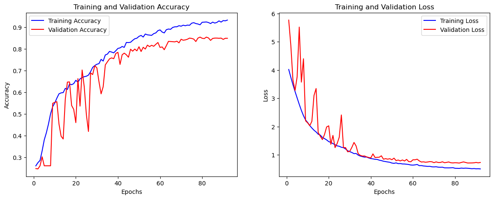
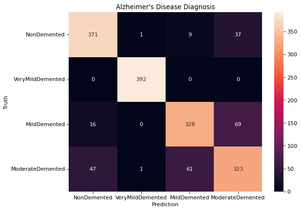
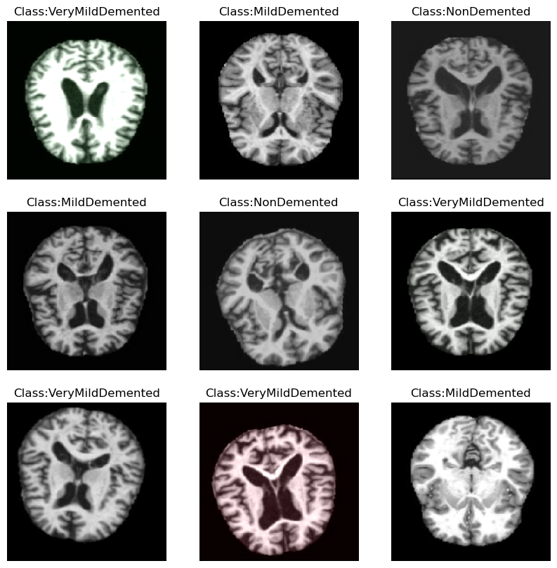

# 🧠 Early Detection of Alzheimer’s Disease using Convolutional Neural Networks

This project implements a deep learning pipeline for **early diagnosis of Alzheimer’s disease** using MRI brain scans.  
The model classifies images into four categories:  
- **Non Demented**  
- **Very Mild Demented**  
- **Mild Demented**  
- **Moderate Demented**

By leveraging a **custom-built CNN in TensorFlow/Keras**, along with advanced data preprocessing and augmentation, the model helps in detecting Alzheimer’s progression at earlier stages.

---

## 🚀 Motivation
Alzheimer’s disease is one of the most common forms of dementia, with early diagnosis being critical for patient care.  
This project explores how **computer vision and deep learning** can automate MRI scan classification to assist radiologists in medical decision-making.

---

## Key features
- Convolutional Neural Network (custom CNN blocks) implemented in TensorFlow / Keras.
- Imbalance handling via SMOTE after flattening image tensors.
- Training utilities: EarlyStopping, ReduceLROnPlateau, ModelCheckpoint.
- Plots for accuracy, loss and AUC, plus final model export

---

## ⚙️ Technical Approach

- **Dataset**: Kaggle – [Alzheimer’s MRI Dataset (4 classes)](https://www.kaggle.com/datasets/sachinkumar413/alzheimer-mri-dataset)  
- **Data Preprocessing**:
  - Image resizing to `176x176x3`
  - Normalization
  - Extensive **data augmentation** (rotation, zoom, shifts, flips)
  - Class imbalance handled with **SMOTE oversampling**
- **Model Architecture**:
  - Custom **Convolutional Neural Network (CNN)** with:
    - Stacked Conv2D → BatchNorm → MaxPooling blocks
    - Dropout layers for regularization
    - Dense fully connected layers with L2 regularization
  - Final **Softmax layer** for 4-class classification
- **Training Enhancements**:
  - Learning rate scheduling (`ReduceLROnPlateau`)
  - Early stopping to prevent overfitting
  - Mini-batch training (batch size = 32)

---

## 📊 Results

| Metric            | Training | Validation | Test  |
|-------------------|----------|------------|-------|
| **Accuracy**      | ~95%     | ~87%       | **84–86%** |
| **Loss**          | Low convergence with minimal overfitting |
| **AUC**           | ~0.91 (macro average) |

- The model achieved **~85% test accuracy** on unseen MRI scans.  
- Learning curves show reduced overfitting after introducing dropout + L2 regularization.  
- Performance demonstrates strong generalization even without pretrained models.

---

## Training Curves

  

---

## Confusion Matrix

  

---

## Examples of Alzheimer's Detection

  

---

## 🔧 Tech Stack

- **Languages**: Python  
- **Frameworks/Libraries**: TensorFlow, Keras, scikit-learn, imbalanced-learn, Matplotlib, NumPy, Pandas  
- **Hardware**: Trained on Apple M1/M2 GPU acceleration  

---
